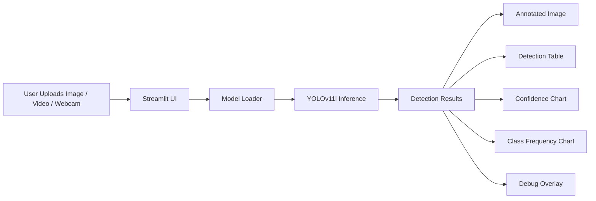

# Project Architecture

This document explains how MarineVision Deep Ocean Intelligence is structured and how data flows through the app.

## High-level flow

## Main modules

### `app.py`

The app entry point. It:

- configures the page
- loads the CSS and sidebar
- handles batch upload and live webcam tabs
- sends each image/frame to the detection pipeline

### `utils/model_loader.py`

Loads the YOLO model once and caches it with Streamlit so repeated inference is faster.

### `utils/inference.py`

Contains the detection pipeline:

- image conversion
- YOLO inference
- dataframe creation
- annotated image generation

### `components/analytics.py`

Renders the result dashboard:

- metrics
- download button
- confidence histogram
- class frequency chart
- side-by-side comparison
- debug overlay

### `components/webcam.py`

Uses `streamlit-webrtc` for real-time webcam inference.

### `utils/visuals.py`

Builds Plotly charts and debug overlay images.

## Detection data model

The detection dataframe contains:

- class id
- class name
- confidence
- bounding box coordinates
- width / height
- area

## UI design system

The app uses:

- a dark ocean background
- cyan/turquoise highlights
- glassmorphism cards
- responsive layout
- subtle motion and hover states
